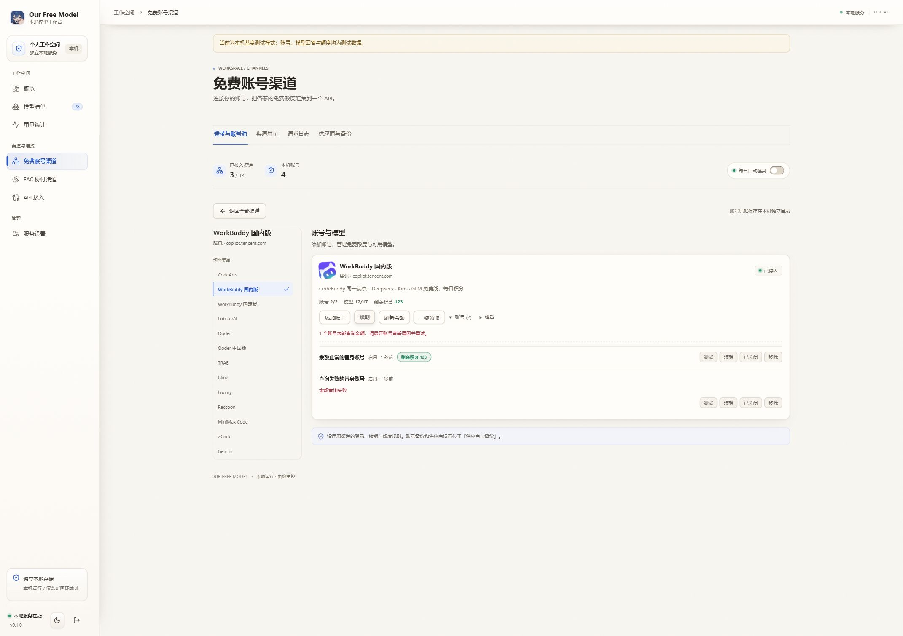
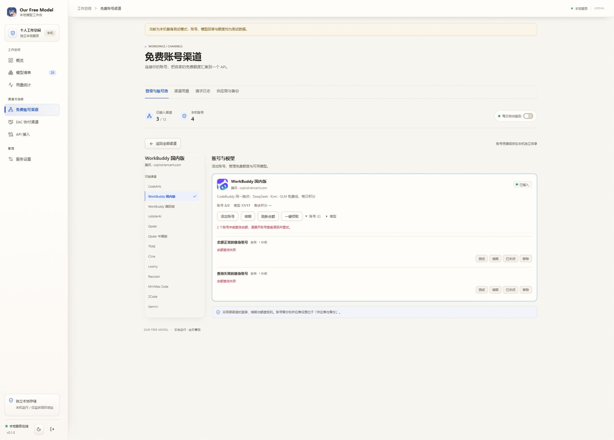
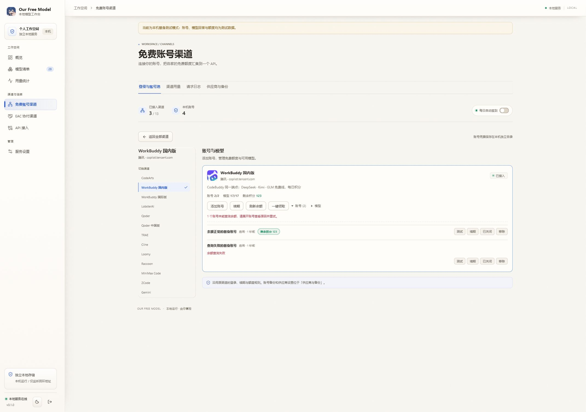
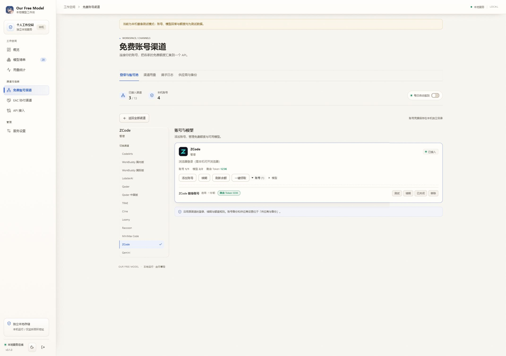
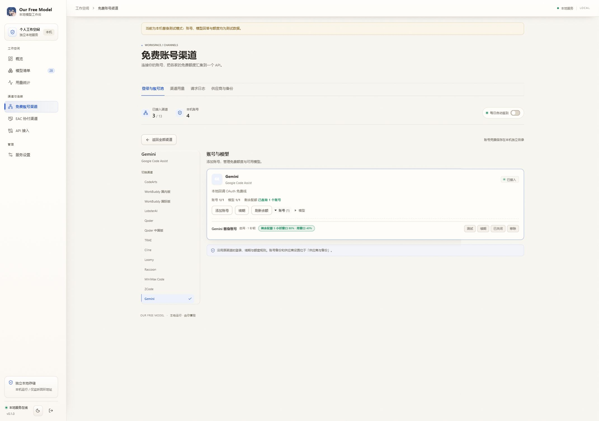

# issue #178：渠道余额反馈验收

日期：2026-10-10。范围：共享渠道页面、插件 RPC、独立服务生成产物。

## 问题定位

issue #178 引用的 ZCode 注释描述历史上的凭据回退问题。当前版本已经优先读取账号池，余额 RPC 也按账号的 `credentialRef` 解析凭据。使用仅有账号池凭据的替身测试确认七个渠道能查余额，ZCode 的 `current()` 和 `status()` 能读取账号池。

本次确认并修复的共享页面问题：

- 余额能力名单遗漏 TRAE、Cline、Raccoon、ZCode、Gemini。
- 余额与签到共用能力判断，WorkBuddy 国际版错误地显示领取入口。
- 查询异常与单账号失败没有展示；签到状态重复解包，今日已领徽标失效。
- Gemini 会缓存失败结果，手动刷新必须携带可选 `force: true` 才能真正重试。

没有验证真实账号或上游，因此不声称解决了所有厂商的登录与余额协议问题。

## 能力与数据边界

| 渠道 | 展示单位 | 一键领取 | 独立签到状态查询 |
| --- | --- | --- | --- |
| CodeArts | 积分 | 是 | 否 |
| WorkBuddy 国内版 | 积分 | 是 | 是 |
| WorkBuddy 国际版 | 积分 | 否 | 否 |
| LobsterAI | 积分 | 是 | 否 |
| Qoder / Qoder 中国版 | 积分 | 是 | 否 |
| TRAE | 积分 | 是 | 否 |
| Cline | USD | 否 | 否 |
| Loomy | 积分 | 是 | 否 |
| Raccoon | 积分 | 否 | 否 |
| MiniMax Code | 积分 | 是 | 是 |
| ZCode | Token | 是 | 否 |
| Gemini | 每个配额窗口的百分比 | 否 | 否 |

独立签到状态查询仅使用已有后端真实支持的渠道。所有渠道保留原登录、续期与领取协议。

零余额正常显示。失败显示未知余额及后端原因；部分失败保留成功账号余额并显示失败计数。Gemini 的不同配额窗口分别展示，卡片汇总只显示已查询账号数。

手动刷新和账号写入后的查询携带 `force: true`；只有 Gemini 消费该选项，自动读取保留原缓存。余额请求按代次隔离，写入前的迟到结果与卸载后的结果不能覆盖新状态。重复点击领取不会重复发送请求。

## 实际验证

最终源码与生成产物已执行：

提交前合入主线 `0b7ec68`（含 PR #190 的 UI 动画），生成文件冲突通过重新构建解决。合并后再次执行贡献者回归 33/33、页面生成检查、文案检查和独立端类型检查，并刷新部分成功页面截图。

| 命令 | 结果 |
| --- | --- |
| `node scripts/build-channel-pack.mjs` | 成功，pack 约 2.74 MiB |
| `node scripts/build-standalone-channels.mjs` | 成功 |
| `node scripts/channel-pack-test.mjs` | 通过，含共享页面及实际 RPC 回归 |
| `node scripts/standalone-channels-test.mjs` | 12/12 通过 |
| `node scripts/test-all.mjs --mode contributor` | 33/33 通过 |
| `node scripts/client-lint.mjs` | 424 个文案键、141 条样式规则通过 |
| `node --check scripts/standalone-ui-preview.mjs` | 通过 |
| `node scripts/build-standalone-ui.mjs --check` | 10 个本地资源一致；两条既有 lucide `use client` 忽略警告 |
| `npm run typecheck:standalone` | 通过 |
| `git diff --check` | 通过 |
| `node scripts/test-all.mjs --mode release` | 0/3；清单摘要、大小和 catalog revision 未更新 |

渠道包构建使用 esbuild 0.24.2、jose 6.2.8、undici 8.11.2，与原产物的依赖代码一致。生成 pack 仅改变 Gemini 调用参数；独立渠道额外更新原包 SHA256。没有手改生成文件或引入依赖升级。

发布检查失败需要维护者按仓库现有 `release-sign` 流程更新清单、catalog 和签名；本次没有修改信任公钥、伪造签名或发布 release。

未执行：真实 DSH 桌面宿主、真实厂商账号、真实签到领取。共享组件与实际插件 bundle 使用替身测试，独立端使用隔离预览服务。

## 浏览器验收

预览地址：`http://127.0.0.1:18906/?issue=178`。使用专用忽略目录 `.verify/ui-credits-data`，自动签到与模型自动刷新关闭。所有账号、Token 和余额都是替身数据。正式 CLI 不加载预览脚本。

1. WorkBuddy 国内版：正常账号显示 123，失败账号显示原因，卡片提示一个账号未能查询。
2. 替身上游全部返回 502：显示两个失败账号，汇总为 `—`，没有伪造零余额。
3. 恢复上游后点击“刷新余额”：正常账号恢复 123，另一个账号仍保留失败状态。
4. ZCode：卡片和账号行显示 123K Token，保留刷新与领取入口。
5. Gemini：显示 5 小时窗口 80%、周窗口 40%，汇总为“已查询 1 个账号”，没有领取按钮。

### 部分成功

### 查询失败

### 重试恢复

### ZCode

### Gemini

## 配置与回退

不迁移账号数据，不改变凭据存储位置。RPC 新字段可选，原调用保持兼容。回退本 PR 的代码并重新构建共享页面与独立渠道产物即可；无需删除账号或数据目录。

Git 仅包含源码、生成资源、测试、验收文档与实际截图；替身凭据、管理令牌、日志和测试数据目录均未纳入提交。
